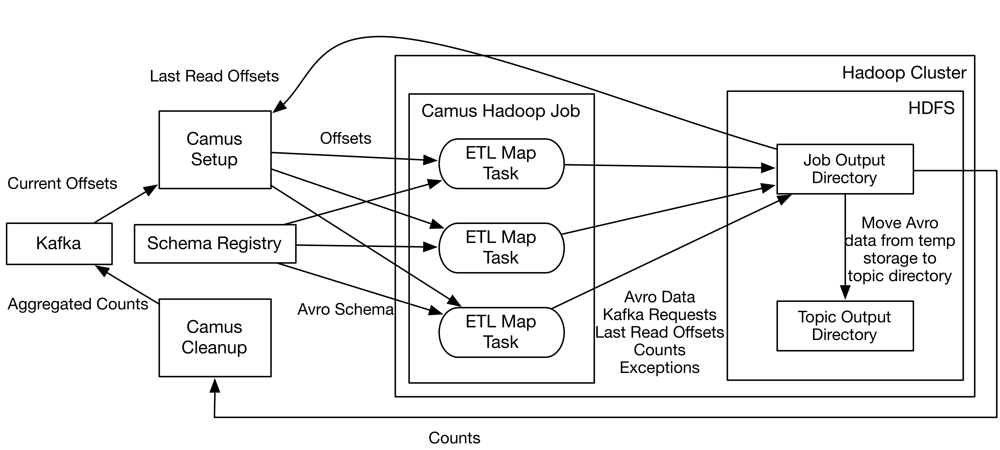

.. _camus_design:

Design
======

The above diagram shows the Camus architecture and the workflow to load Avro data to HDFS.
Avro data loading is done within a single MapReduce job divided into the following stages:

#. Setup stage: Fetches topics and partitions from Zookeeper and latest offsets from Kafka.
#. Hadoop stage: Allocates a set of ETL map tasks to pull data from Kafka. The final topic partition
   offsets is computed from previous Camus job execution and latest offsets from Kafka. ETL map tasks
   look up Avro schemas in the Schema Registry in order to deserialize the data and project
   it to the latest schema. The ETL map tasks first write Avro files to temp storage in the job output
   directory and then copy them to the topic output directory upon Camus job success. Camus also saves
   final read offsets, decoding exceptions and counts in the job output directory for use of
   future Camus jobs.
#. Cleanup stage: Camus collects counts from ETL map tasks and submits them to Kafka for consumption
   by other systems.